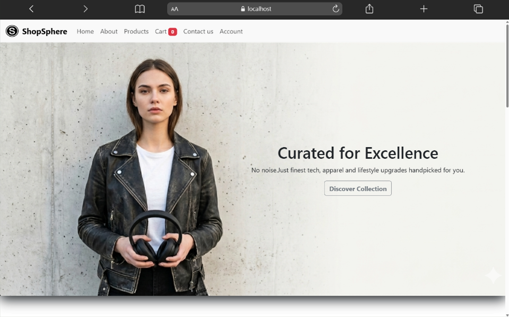
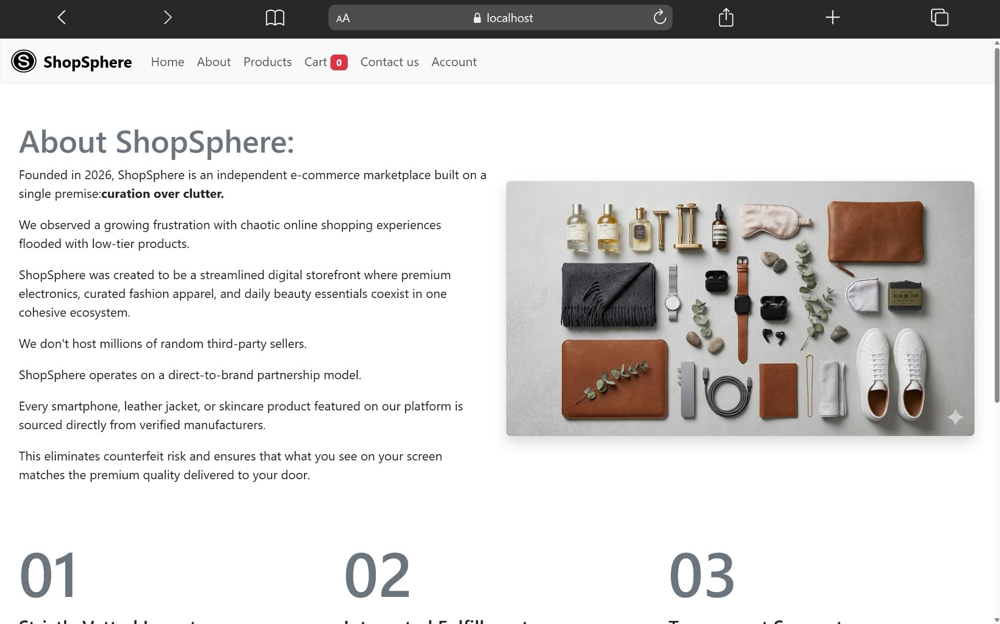
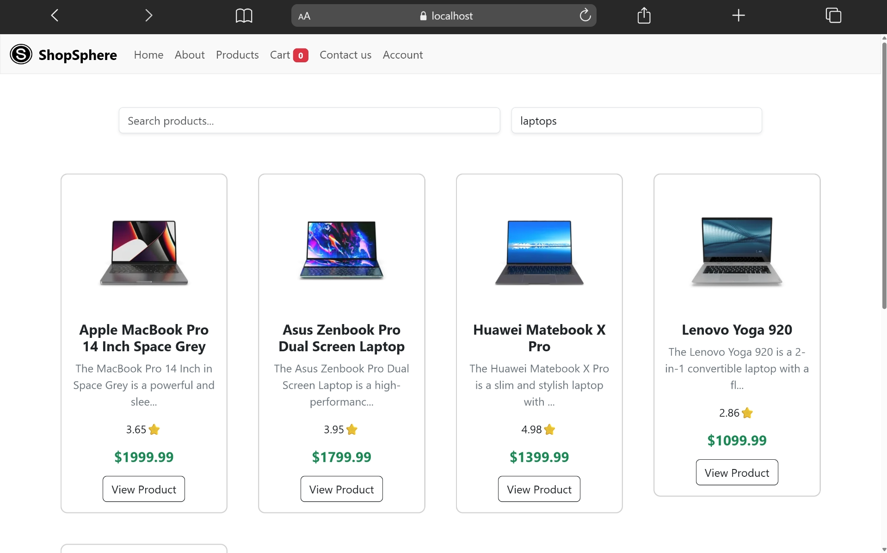
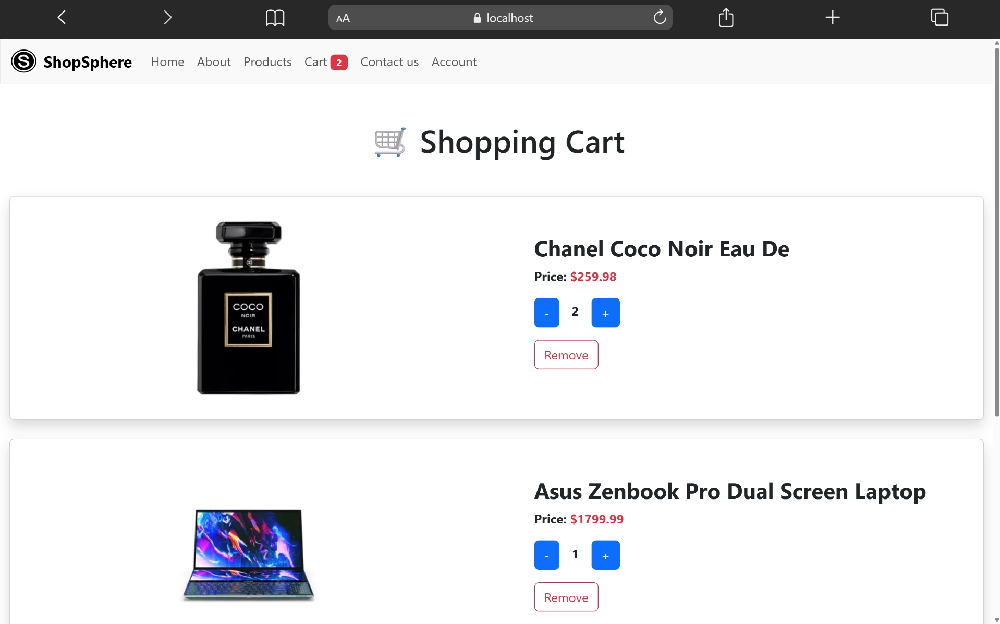
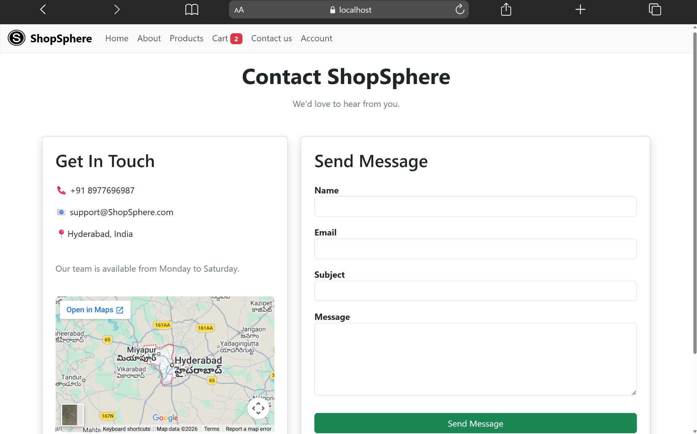

# 🛒 ShopSphere - E-commerce React App

ShopSphere is a modern e-commerce web application built using React, Redux, and DummyJSON API.

---

## 🌐 Live Demo

🔗 https://shopsphere-nine-nu.vercel.app/

---

## 🚀 Features

- Product Listing using DummyJSON API
- Product Search
- Category Filtering
- Product Details Page
- Add / Remove from Cart
- Quantity Management
- Redux Toolkit State Management
- Cart Persistence using Local Storage
- Responsive Design

---

## 🧠 Tech Stack

- React JS
- Redux Toolkit
- React Router DOM
- Axios
- Bootstrap / CSS

---

## 🛍️ Flow

Home → Products → Product Details → Add to Cart → Cart → Checkout

---

## 📸 Screenshots

### Home Page

### About Page

### Products Page

### Cart Page

### Contact Page

---

## 👨‍💻 Developer

Built with ❤️ by Karthik

- GitHub: [skyadav227](https://github.com/skyadav227)
- LinkedIn: [Karthik](https://www.linkedin.com/in/sher-karthikeya-yadav-009193226/)
